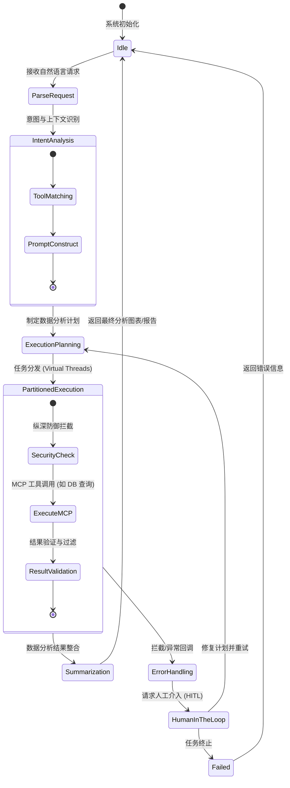

# AgentOS

**AgentOS** 是一个面向真实业务场景的自然语言驱动的数据分析自动化系统。作为下一代企业级 Agent 底座，本项目致力于将大语言模型（LLM）的分析能力与企业级应用的稳定性、高并发和安全性完美结合。

## 🌟 核心理念与架构

AgentOS 深度参考了行业前沿的 Agent 架构设计（如 Claude Code 的设计模式），并结合 Java 21 虚拟线程特性，打造了一个高性能、高安全性的运行环境：

1. **Agent Harness (智能体线束层)**: 提供对 LLM 的生命周期管理、Prompt 结构化编排、多轮对话状态追踪以及工具调用（Tool Use）的严格路由机制。
2. **并发分区架构 (Concurrent Partition Architecture)**: 利用 Java 21 的 Virtual Threads 和基于状态的事件循环模型，对长耗时的分析任务进行隔离和高并发处理，避免传统线程池的资源耗尽问题。
3. **纵深权限防御管线 (Defense in Depth Pipeline)**: 面向数据分析场景，提供从网络层、沙箱执行层到数据访问层的多级权限校验，确保 Agent 生成的查询和代码在受限、审计和可控的安全沙箱内运行。

## 🏗️ 系统执行流状态机

下面是 AgentOS 核心任务调度与分析执行的内部状态机流程：

## 📂 项目结构

本项目由以下核心模块构成：

- `agentos-core/`: 后端核心基座 (Java 21 + Spring Boot 3)，包含 Agent Harness 和并发分区调度器。
- `agentos-mcp-tools/`: 模型上下文协议 (Model Context Protocol) 工具集，提供与数据库、API 和文件系统交互的标准接口。
- `agentos-dashboard/`: 前端交互与监控大盘 (React)，提供数据可视化展示、人机协同 (Human-in-the-loop) 审核界面以及系统状态监控。

## 🚀 快速开始

*(项目还在积极开发中，敬请期待完整的启动指南...)*

## 🤝 参与贡献

我们欢迎所有对 Agent 架构、数据分析和高并发开发感兴趣的开发者参与贡献！请查阅 [CONTRIBUTING.md](CONTRIBUTING.md) 了解我们的代码规范、提交流程以及架构设计原则。

## 📄 许可证

本项目采用 MIT 许可证。有关详细信息，请参阅 LICENSE 文件。
